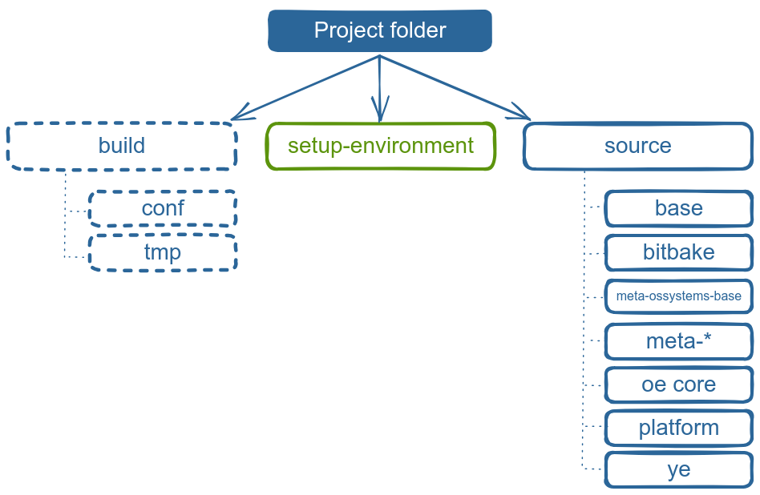

# O.S. Systems Embedded Linux Platform
[*by O.S. Systems Software*](ossystems.com.br)


## Overview

This repository offers a complete platform which provides all source code to start an Yocto project using our O.S. Systems Embedded Linux distro (OEL), our layer (O.S. Systems Base) and our development tools.
Yocto Project, an essential framework in embedded Linux development, empowers us to build custom Linux distributions with optimized configurations for our target hardware.

**The Key Objectives of This Repository Are:**

1. **Simplified Setup:** By utilizing the **Repo** tool, we provide an effortless way to clone all required dependencies, ensuring that team members can quickly get started with the Yocto project.
2. **Dependency Management:** The **Repo** tool simplifies managing multiple repositories, enabling us to stay up-to-date with the latest changes and updates across various components efficiently. 
3. **Version Control:** Our repository leverages the power of version control, allowing us to track changes to the Yocto environment over time, facilitating collaboration among team members and ensuring project stability.
4. **Customization:** With this Yocto environment, we can easily tailor Linux distributions to match the specific requirements of our project, optimizing performance, and minimizing overhead.
5. **Consistent Environment:** By using the **Repo** tool, we guarantee that all team members work in a **consistent Yocto environment**, reducing potential discrepancies and ensuring seamless collaboration.

### What is Repo?

Repo is a powerful tool built on top of Git, designed to enhance the management of multiple Git repositories. It streamlines the development workflow, automates certain tasks, and facilitates seamless collaboration within complex projects. Repo is not meant to replace Git, but to make it easier to work with Git.

### Why use Repo?

Using Repo for the Yocto Project offers numerous advantages to streamline the development process. As the Yocto Project encompasses various repositories with complex interdependencies, Repo simplifies the management of these repositories by allowing developers to work with a single manifest file. This ensures consistency across the entire project, making it easier to synchronize, update, and manage multiple repositories. Moreover, Repo enables teams to collaborate effectively, maintaining a unified codebase with coordinated branches and tags. By leveraging Repo, developers can efficiently handle the intricacies of the Yocto Project, improving productivity and ensuring a more seamless and organized development experience.

## The structure of our platform



### Source folder

Source folder hosts all metadata necessary to build a Yocto image:

- **base** - Provides the basic scripts that mount the Yocto environment.
- **bitbake** - Includes a copy of BitBake for ease of use. The copy usually matches the [current stable BitBake release](https://wiki.yoctoproject.org/wiki/Releases) from the [BitBake project](https://github.com/openembedded/bitbake).
- **meta-ossystems-base** - This layer provides the base for the O.S. Systems Embedded Linux.
- **meta-\*** - These are the layers used by the project. All layers must be cloned here (at the source directory).
- **oe-core** - OpenEmbedded-Core is a layer containing the core metadata for current versions of OpenEmbedded.
- **platform** - Contains a Repo manifest, which describes the structure of a repo client, which contains information about the placement of the source code and where they should be obtained from.
- **ye** - YE (Yocto Explorer) is a command-line tool to ease the manipulation of files under the directory structure adopted by O.S. Systems to organize projects that use the Yocto Project. For more information about this tool visit the [YE repository](https://github.com/OSSystemsEmbeddedLinux/ye).

### setup-environment

This is the script which prepares all the Yocto environment. We'll describe on the session [What is setup-environment?](#what-is-setup-environment).

### build

This folder contains all building configurations, temporary files. The "build" directory is created after run `source-environment` script. We'll describe better later on [Preparing the Yocto environment](#preparing-the-yocto-environment).

### O.S. Systems Base

This layer is the core of the embedded Linux developed by O.S. Systems. It provides the O.S. Systems Embedded Linux (OEL) distribution and a set of helpers used for multiple products being developed with OpenEmbedded and/or Yocto Project.
To learn more about this layer, please visit the [meta-ossystems-base repository](https://github.com/OSSystemsEmbeddedLinux/meta-ossystems-base).

## Preparing the environment

### How do I get Repo?

If you don't have Repo installed on your host machine, you need to install it.

For Debian/Ubuntu Linux distro, you can install it by running:

```sh
sudo apt install repo
```

If you're using another Linux distro or the `repo` tool is not in the repository, you can download it directly from upstream and set up your distro as shown below:
```sh
mkdir ~/bin
curl http://commondatastorage.googleapis.com/Repo-downloads/repo > ~/bin/repo
chmod a+x ~/bin/repo
PATH=${PATH}:~/bin
```

### Required Packages for the Build Host

Here are the packages needed to build an image on a Ubuntu or Debian Linux distribution:
```sh
sudo apt install gawk wget git diffstat unzip texinfo gcc build-essential chrpath socat cpio python3 python3-pip python3-pexpect xz-utils debianutils iputils-ping python3-git python3-jinja2 libegl1-mesa libsdl1.2-dev python3-subunit mesa-common-dev zstd liblz4-tool file locales
sudo locale-gen en_US.UTF-8
```

See [Yocto Project Reference Manual - Detailed Supported Distros](https://docs.yoctoproject.org/ref-manual/system-requirements.html#supported-linux-distributions) for details.

### Download the platform source

The next step is to download the BSP (Board Support Packages) source code. We have a platform to fetch all the files necessary to build the project.

To download all sources, run the following commands:
```sh
mkdir ossystems-embedded-linux-platform
cd ossystems-embedded-linux-platform
repo init -u git@github.com:OSSystemsEmbeddedLinux/ossystems-embedded-linux-platform.git -b scarthgap
repo sync
```

At the end of the commands, you will have all the metadata you need to start working with.

## Building an Yocto image using Bitbake

Now you have all downloaded source code, you can build an image using Bitbake. To set the Yocto environment use the `setup-environment` script.

### What is setup-environment?

`setup-environment` is a script which, as the name suggests, sets the Yocto environment. So it automatically add all the project layers that you need to `build/conf/bblayers.conf` in the proper order, also it prepares the `local.conf` file setting basic variables like the Yocto machine (`MACHINE` variable), the Yocto distribution (`DISTRO` variable) and other essencial variables. It makes the process of preparing the Yocto environment for building much more faster!

### Preparing the Yocto environment

Before starting to work, you need to load the Yocto Project variables to run the `bitbake` command:

```sh
MACHINE=<yocto-machine> source setup-environment build
```

The O.S. Systems Embedded Linux Reference Platform is BSP agnostic, having no vendor-specific BSPs included. We rely on the OpenEmbedded-Core to provide a set of emulated devices, using QEMU, to use as reference.

Check the machines which are included, [here](https://git.openembedded.org/openembedded-core/tree/meta/conf/machine).

Note that you need to run the command above for each new terminal. The loaded variables are only visible to the terminal where you sourced the `setup-environment` script.

### Building a image

For this project, you have the following images available for building:

| Yocto image                 | Description                                                                           |
| --------------------------- | ------------------------------------------------------------------------------------- |
| initramfs-psplash-image     | Small image with psplash implementation to use as an alternative to the splash kernel.|
| ossystems-minimal-initramfs | The very minimal initramfs image capable of booting a device.                         |

Also you can build an OpenEmbedded Core image (e.g. core-image-base) or even create your own custom image.

To build the image, inside the terminal where you run `source setup-environment build`, run:

```sh
bitbake <yocto-image>
```

This process can take a long time depending on your host machine.

When the image is ready, the resulting files are available in the `deploy` directory. By default, it is located at `build/tmp/deploy/images/<yocto-machine>/`.

To use this image, you need to flash it to an SD card (which will be used to boot the board). The image file extension varies from project to project. In this project, the generated image will have the **.wic.gz** extension. You will also need the **bmap file** which has the same name of the image but with extension **.bmap**.

Now write the SD card with the image using **bmaptool**. If you don't have **bmaptool** installed on your host machine then you can install by running:

In a Debian/Ubuntu based distro:

```sh
sudo apt install bmap-tools
```
 
Now, run:

```sh
sudo bmaptool copy <image-name>.wic.<image-extension> /dev/<device-name>
```

Ready! Now you can boot your device using the SD Card.

## How can I modify this platform?

We strongly recommend read our [Modifying This Platform](modifying-platform.md) article.

## References

- [Heading for the Yocto Project](https://github.com/CollaborativeWritersHub/heading-for-the-yocto-project/releases/download/18.10.0/Heading-for-the-Yocto-Project.pdf)
- [Embedded Linux Development using Yocto Projects - Third Edition](https://www.amazon.com.br/dp/B0BRCTY345/)
- [Yocto Project Reference Manual](https://www.yoctoproject.org/docs/3.1/ref-manual/ref-manual.html#detailed-supported-distros)

## Get in touch

- E-mail: [contato@ossystems.com.br](mailto:contato@ossystems.com.br)
- Webpage: https://www.ossystems.com.br/
