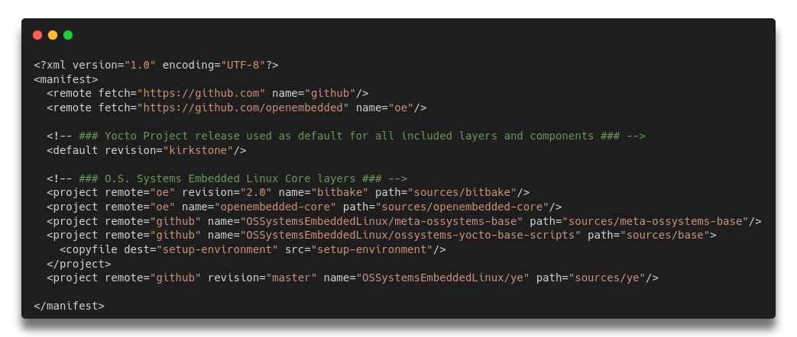
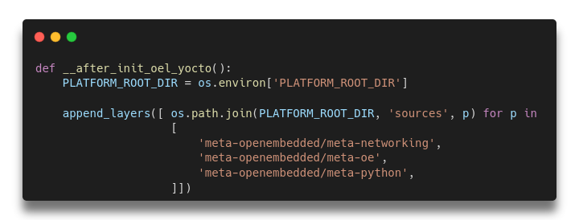
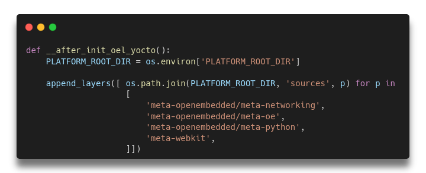

# Modifying This Platform

When you want to modify an Yocto project adding a layer, for example, is trivial to use the command `bitbake-layers add-layer ../../meta-<example>`. But if we want to make it persistent (so other collaborators can clone the project and work together) you must add it to the **default.xml** manifest file.

## Understanding the manifest file structure

A repo manifest describes the structure of a repo client; that is the directories that are visible and where they should be obtained from with git.
Manifests are inherently version controlled, since they are kept within a Git repository.

This is an example of Repo manifest:



As you can see, it's a simple markup file. Basically it defines the remotes which will be pulled by **Repo**, the name of the repositories **(which in Repo syntax it's called  "project")**, the revision and the destiny path. 

### Element remote

Each remote element specifies a Git URL shared by one or more projects.

- `fetch`: This attribute will define the URI of the repository to fetch. Most commonly you'll see https and ssh protocols. Note that you must grant permission to access the repositories.
- `name`: It will be the name you'll call instead the whole URI. It makes the manifest looks cleaner.

### Element project

Each element describes a single Git repository to be cloned into the repo client workspace. 

- `remote`: Name of a previously defined remote element. If not supplied the remote given by the default element is used.

- `path`: An optional path relative to the top directory of the repo client where the Git working directory for this project should be placed. If not supplied the project “name” is used. If the project has a parent element, its path will be prefixed by the parent's.

- `revision`: Name of the Git branch the manifest wants to track for this project. Names can be relative to refs/heads (e.g. just “main”) or absolute (e.g. “refs/heads/main”). Tags and/or explicit SHA-1s can be used too. If not supplied the revision given by the remote element is used if applicable, else the default element is used.

### Element default

Its remote and revision attributes are used as default when a project element does not specify its own remote or revision attribute. In the example above, the default revision is `nanbield`, so all projects which doesn't specify a revision will be fetched from **nanbield** revision.

### Element copyfile

Zero or more copyfile elements may be specified as children of a project element. Each element describes a src-dest pair of files; the “src” (source) file will be copied to the “dest” place during `repo sync` command.

## Adding a layer to the platform

### Adding a layer to manifest file

First, you need to add the `remote` element, if it doesn't exist. In this example, we will add a layer from GitHub. So first we need to assure the remote is present on the manifest. If not, add the Github remote:
```xml
<remote fetch="https://github.com" name="github"/>
```

In the snippet above we're adding a ssh remote to a repository through the attribute `fetch`. We'll call this remote `bitbucket` through the attribute `name`.

Now we'll add the element `project`:

```xml
<project remote="github" revision="master" name="MyOrganization/meta-example" path="sources/meta-example"/>
```

So we'll add a remote called `github`, that we declared on `remote` element. The revision will be set to `master`, as the default revision of the manifest is `nanbield`. The path to the organization and repository is `MyOrganization/meta-example`. Finally, the path destination is `source/meta-example`, where the `meta-example` will be cloned.
So, when Repo parse it, it will clone from `https://github.com/MyOrganization/meta-example` into `source/meta-example` directory.

### Adding a layer to setup-environment

This step is crucial, as `setup-environment` is responsible for effectively add the layer to the project. So open the `setup-environment` and find the `append_layers` function:



Now we'll add the `meta-example` to the list:



Commit the changes and push to the platform repository.

Ready! When somebody init this platform, the `meta-example` layer will be automatically cloned and added to `conf/bblayers.conf`.
